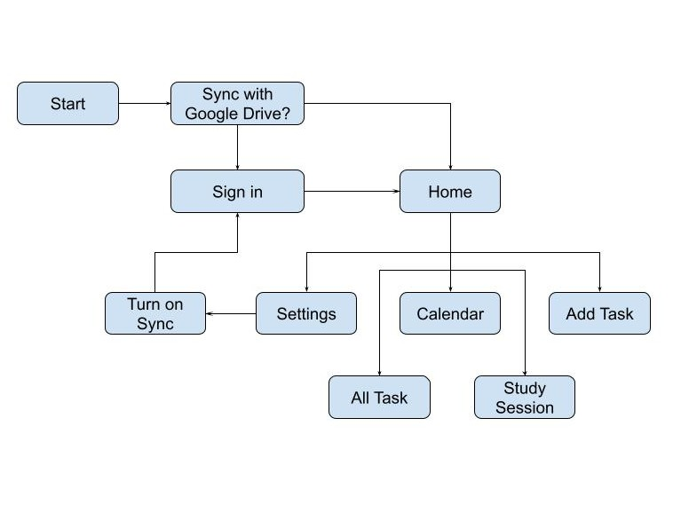
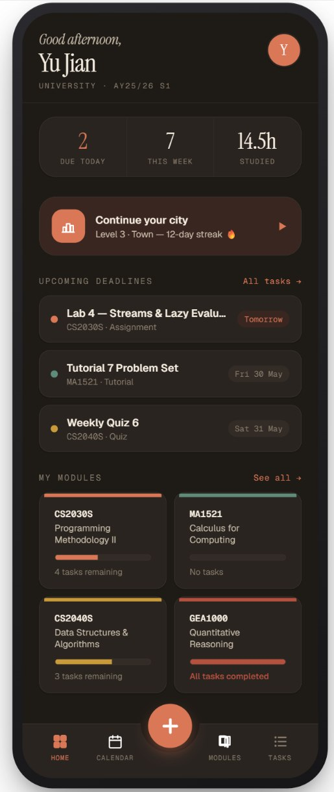
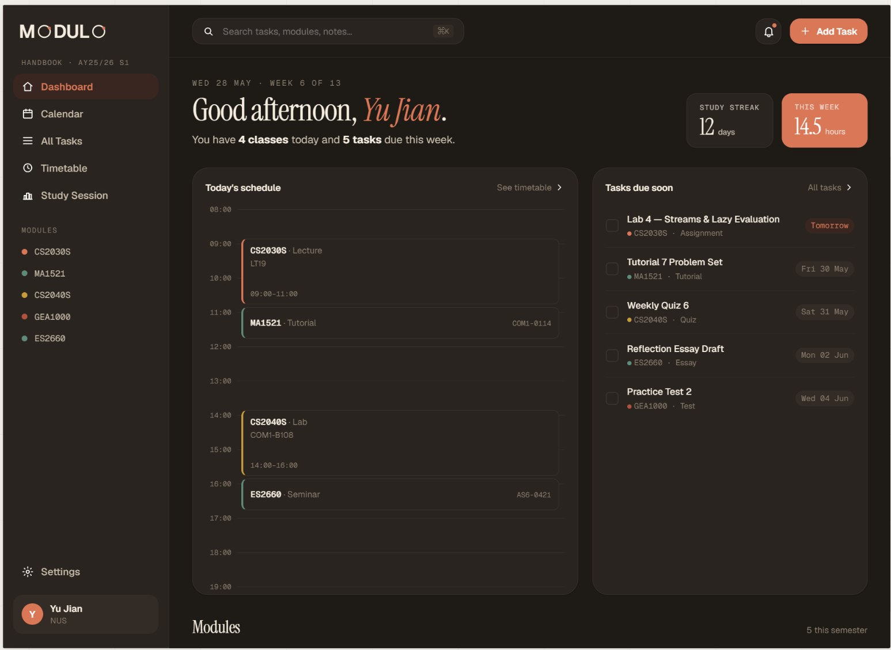

# modulo
A companion platform for Singaporean students to manage academic tasks, parse their timetables, and stay focused through gamified study sessions.

## Level of Achievement
Apollo 11

## Team
- Koh Yu Jian
- Chen Ling Song

## Motivation
As students, managing multiple academic responsibilities can be overwhelming, often leading to missed deadlines and forgotten assignments. Many of us message ourselves with tasks throughout the semester, which is difficult to keep track off. Other note taking apps such as Notion have a steep learning curve.

## User Stories
1. As a student who wants to stay organised during learning, I want an app that conveniently settles my timetable into useful blocks to organise my tasks and assignments.
2. As a student, I want to be able to comfortably and easilty keep track of my tasks. Managing different dealines, I want to be able to prioritise certain tasks.
3. As a student who owns multiple devices, I want to be able to access my schedule and tasks regardless of which device I am using
4. As a student who wants to stay motivated for their learning. I would like to have a game to track my productivity so I can feel accomplished and hold myself accountable for my study period.
5. As a student who want convenience, I want a one-stop app that has a friendly interface with all my study materials assessible
6. As a student, I want to be able to keep track of my results and academic progress.

## Overview
modulo turns a photo of a school timetable into a structured, editable schedule, then layers task management, a calendar view, and a gamified study experience on top of it. The goal is a single, easy-to-use home for everything academic.

## Build and Run
### Tester Login Credentials
Use this tester email when choosing to sync with Google Drive
* **Email:** `modulotesting123@gmail.com`
* **Password:** `orbitalmodulo123`

### Running App Version
* [Android Studio](https://developer.android.com/studio) installed.
* An Android Virtual Device (AVD) configured via the Android Studio Device Manager

1. Launch Android Studios
2. Select **Open** and choose `modulo/app`.
3. Open the **Device Manager** (Tools > Device Manager) and start your configured **Android Virtual Device (AVD) / Emulator**.
4. Launch the emulator with the green **Run** icon.
5. Login into Play Store with tester account first before logging into the modulo app. Exit the app if you have to.
6. Click **Sync with Google Drive**

### Running Web Version
* [Visual Studio Code](https://code.visualstudio.com/) installed.
* **Live Server** extension by Ritwick Dey installed in VS Code.

1. Open Visual Studio Code.
2. Select **File > Open Folder...** and choose `modulo/web`.
3. Look at the status bar at the bottom right of the VS Code window and click on the **Go Live** button.
4. Your default web browser will automatically open and navigate to the local hosting address.
5. Click **Connect to Google Drive**.

## Features
### Google Drive Sync
**Proposed**: Use Google Drive to sync notes and data between the app and website. Users can also choose to continue with local save only.

**Current Progress**: Syncing has been implemented between the app and web, alongside a fixed JSON schema.

**Future Progress**: Conflict management between local save and cloud copy needs to be implemented. Automatic and periodic downloading of cloud copy, and a setting to turn on syncing needs to be added.

### Task Tracker
**Proposed**: A task section where the students can categorise their task into different sub-categories. When adding the task, students can select task deadline, type of task, and frequency of reminders

**Current Progress**: A preliminary task adding system has been implemented on both app and web. Tasks can be added and marked for completion.

**Future Progress**: Deletion of tasks, as well as filtering and sorting

### Timetable Parser
**Proposed**: Snap or upload a timetable image and have it parsed into structured data using the Gemini vision API, with a manual edit screen for corrections.

**Current Progress**: A proxy server for to hold our prompts and API keys, which talks to Gemini and passes the response back, has been implemented.

**Future Progress**: Both web and app needs to fetch data from this proxy server and display on thier UI.

### Study Session
**Proposed**: Users can start a study session and keep track of their productivity. Once the session ends, the app will update the calendar to reflect on the productivity of the day, which the user can select. 

**Current Progress**: As of MS1, this feature has not been implemented

**Future Progress**: The above

**Additional Feature**: A city-building mechanic that rewards focused study time. The longer the user studies in the session, the bigger the simulated city game will grow.

### PDF and Notes Support
**Proposed**: Support for students to store personal notes and other documents needed for school (links or pdf) in the modules page, and support the ability to annotate on the documents directly.

**Current Progress**: As of MS1, this feature has not been implemented

**Future Progress**: The above

## Tech Stack
| Area | Technology |
|------|-----------|
| Design | Figma |
| Mobile app | Kotlin, Jetpack Compose (Material 3) |
| Website | HTML / CSS / JavaScript |
| Navigation | Navigation Compose |
| Auth & Sync | Google Sign-In (Credential Manager), Google Drive API (`drive.appdata` scope) |
| Timetable parsing | Gemini Vision API |
| Build | Gradle (Kotlin DSL), AGP |

## User Flow Diagram

## Designs

## Timeline and Development Plan
| MS | Task | Description | In-Charge | Date |
|----|------|-------------|-----------|------|
| 1 | Conceptualisation and Ideation |Design the structure and worflow of the app and web | Both | 11 - 15 May |
|  | App UI/UX design | Dashboard, Calendar, Study Session, All Tasks screens for mobile + tablet | Ling Song | May - June 2026 |
|  | Web UI/UX design | Equivalent Dashboard, Calendar, Study Session, All Tasks pages for web | Yu Jian | May - June 2026 |
|  | Google Drive sync | Drive linking for multi-device sync; Google sign-in when linking, local save otherwise | Ling Song (app) / Yu Jian (web) | 24 May - 31 May 2026 |
|  | Task Management | Set up a working structure to keep track of tasks as per specifications | Both | 29 May to 31 May|
| **Eval MS1** | **Deliverables** | Google Drive sync working, Basic task tracking implemented  | — | **1 Jun 2026** |
| 2 | Timetable AI parsing | Gemini vision API reads a timetable image and auto-generates modules/subjects (90% accuracy target); manual edit screen for corrections | Both | May 2026 |
|  | App implementation | Build all designed app screens in Jetpack Compose | Ling Song | 2 – 15 Jun 2026 |
|  | Web implementation | Build all designed web pages | Yu Jian | 2 – 15 Jun 2026 |
|  | Task management | Refine task tracking + reminder notifications | Yu Jian (web) / Ling Song (app) | 2 – 10 Jun 2026 |
|  | Set-up tutorial | Onboarding / setup walkthrough for new users | Both | 10 - 15 Jun 2026 |
|  | Productivity / mood board | Study session productivity tracking reflected on the calendar | Yu Jian (web) / Ling Song (app) | 15 – 20 Jun 2026 |
|  | Notes & file sync | Upload notes/docs to MODULO, synced across devices via Drive | Both | 20 – 29 Jun 2026 |
| **Eval MS2** | **Deliverables** | Full app + web, setup tutorial, task system, productivity board, notes sync | — | **29 Jun 2026** |
| 3 | Gamified study motivator | City-building add-on that grows as study time accumulates | Yu Jian (web) / Ling Song (app) | 30 Jun – 15 Jul 2026 |
|  | Grade calculator | GPA calculator per school grading system; suggests grades needed to raise GPA | Both | 15 – 27 Jul 2026 |
| **Eval MS3** | **Deliverables** | Gamified study motivator, grade calculator | — | **27 Jul 2026** |

## Proof of Concept
Our code for the technical proof of concept is also available in the following GitHub repository:
[Github: modulo](https://github.com/yujiankoh/modulo)
